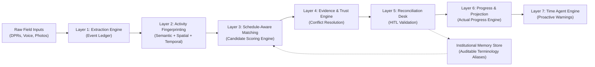

# SATYA SIH 2026 Presentation Deck & Speaker Notes

**Repository:** SATYA (Schedule-Aligned Truth & Yield Analytics) — Oil India Limited (SIH 2026)  
**Document Path:** `docs/11-sih/presentation_deck.md`  
**Purpose:** Slide-by-slide layout, visual content, diagrams, key talking points, and speaker notes for the SIH 2026 presentation deck (12 slides maximum).

---

## Slide Structure & Content Specification

```
Slide 1: Title & Vision  ──────► Slide 2: The Real Problem ─────► Slide 3: The Digitization Gap ──┐
                                                                                                  │
Slide 6: Live Demo Transition ◄─ Slide 5: The Trust Boundary ◄── Slide 4: SATYA Architecture ────┘
  │
  ├──────► Slide 7: Reconciliation Desk  ──► Slide 8: HITL & Institutional Memory
  │
  └──────► Slide 9: Time Agent Warnings ──► Slide 10: Technical Matrix ──► Slide 11: Governance ──► Slide 12: Impact
```

---

### Slide 1: Title & Vision
- **Visual Title**: **SATYA**
- **Subtitle**: Schedule-Aligned Truth & Yield Analytics
- **Tagline**: Evidence-Backed Execution Intelligence for Infrastructure Projects (Oil India Limited — SIH 2026)
- **Visual Element**: Clean, modern dark mode header with Oil India emblem branding and execution pipeline workflow graphic.
- **Speaker Notes**:
  > *"Welcome judges. We are presenting SATYA—an evidence-backed execution intelligence layer built specifically for Oil India Limited to solve the disconnect between field progress reporting and Primavera P6 schedule actuals."*

---

### Slide 2: The Real Problem — Field Reality vs Project Schedule
- **Slide Layout**: Two contrasting columns separated by a central gap graphic.
- **Column A (FIELD REALITY - Messy & Unstructured)**:
  - Daily Progress Reports (Excel, PDF, scanned text)
  - Site photos & informal voice notes
  - Informal field jargon (*"HDD Section 3"*, *"hydro test pending"*)
  - Partial progress claims & non-standard UOM
- **Column B (PROJECT SCHEDULE - Rigid & Structured)**:
  - Primavera P6 / MS Project baselines
  - 10,000+ explicit Activity IDs (`ACT-1020`)
  - Strict WBS hierarchy & predecessor relationships
  - Planned start/finish dates & baseline logic
- **Central Callout (THE EXECUTION GAP)**:
  > **"Field observations do not naturally speak the language of the schedule."**
- **Speaker Notes**:
  > *"Every day, hundreds of field observations are generated across Oil India's pipeline sectors. Planners spend hours attempting to map informal phrases into Primavera P6. This manual reconciliation is slow, error-prone, and un-auditable."*

---

### Slide 3: Why Existing Digitization Isn't Enough
- **Slide Layout**: 3-step horizontal funnel progression.
- **Step 1**: **DIGITIZE** (OCR scanned reports into text)
- **Step 2**: **EXTRACT** (Extract keywords using basic NLP)
- **Step 3**: **THE MISSING QUESTION** $\rightarrow$ **"Can the schedule safely believe it?"**
- **Core Message Box**:
  > **Most systems stop at "We extracted what the report says." SATYA asks: "Can the project schedule safely consume it?"**
- **Speaker Notes**:
  > *"Standard AI chatbots and OCR tools stop after extracting text. But if an AI model hallucinates an Activity ID or accepts an unverified progress claim, it corrupts the baseline schedule. SATYA solves what happens AFTER extraction."*

---

### Slide 4: SATYA Architecture — 10-Tier Execution Intelligence Stack
- **Visual Diagram (Mermaid Architecture Flow)**:

- **Speaker Notes**:
  > *"SATYA operates a 10-tier execution intelligence pipeline. Inputs are ingested into an append-only event ledger, fingerprinted against Primavera schedule context, scored by our matching engine, evaluated for evidence trust, and presented to planners for reconciliation."*

---

### Slide 5: The Trust Boundary — Reality $\neq$ Extracted $\neq$ Scheduled Actual
- **Slide Layout**: 4-stage explicit governance boundary diagram.
```
┌─────────────────┐      ┌─────────────────┐      ┌─────────────────┐      ┌─────────────────┐
│  FIELD REALITY  │  ≠   │  EXTRACTED EVENT│  ≠   │ VERIFIED MATCH  │  ≠   │ SCHEDULE ACTUAL │
│  Raw DPR Text   │      │ Raw Event Claim │      │ Candidate Match │      │ Baseline Update │
└─────────────────┘      └─────────────────┘      └─────────────────┘      └─────────────────┘
```
- **Non-Negotiable Rule**:
  > **SATYA NEVER silently coerces unverified text into baseline schedule actuals.**
- **Speaker Notes**:
  > *"This is SATYA's core technical slide. Field reality, extracted text, matched activities, and baseline schedule actuals are distinct entities. Every transition across these boundaries requires explicit evidence verification or human validation."*

---

### Slide 6: Live Demo — Messy Field Observation to Trusted Truth
- **Slide Layout**: Clean transition slide introducing the 12-minute live software execution.
- **Hero Scenario Case**:
  > **"Night shift: HDD Section 3 crossing completed. Approx. 420 m drilling completed on Line PL-16-01. QA/NDT clearance pending due to hydrotest delay."**
- **Speaker Notes**:
  > *"Let's switch to the live software demonstration. We will track a single, complex daily progress report through SATYA's full execution intelligence stack."*

---

### Slide 7: Why SATYA Believes This — Reconciliation Desk (Hero UI)
- **Slide Layout**: Visual breakdown of the Reconciliation Desk UI layout.
```
┌────────────────────────────────────────────────────────────────────────┐
│ RECONCILIATION DESK — Event EVT-DEMO-101                               │
├──────────────────────────────────┬─────────────────────────────────────┤
│ FIELD CLAIM                      │ SCHEDULE CANDIDATES                 │
│ Text: "Approx 420m drilling..."  │ 1. ACT-1020 (Score: 0.42) [SELECTED]│
│ Location: Section 3              │    + Loc: 0.80  + Term: 0.75         │
│ Quantity: 420.0 m (PIPING)       │    - No Explicit ID  - QA Pending  │
│ QA Status: PENDING               │ 2. ACT-1021 (Score: 0.28)          │
├──────────────────────────────────┴─────────────────────────────────────┤
│ MATCHING DECISION: INSUFFICIENT_EVIDENCE (< 0.80) -> DELEGATED TO HITL │
└────────────────────────────────────────────────────────────────────────┘
```
- **Key Point**: **Conservative Matching by Design**.
- **Speaker Notes**:
  > *"The Reconciliation Desk is SATYA's hero interface. It displays exact candidate matching scores and factor breakdowns. Because 0.42 is below our 0.80 threshold, SATYA conservatively delegates the match to the human planner."*

---

### Slide 8: Human-in-the-Loop & Institutional Memory
- **Slide Layout**: Two-part diagram showing HITL action and Memory Distillation.
- **Part 1 (HITL Action)**:
  - Planner re-maps `"HDD Section 3"` $\rightarrow$ `ACT-1020`.
  - Appends `ValidationDecision` row; creates Version 2 `TrustAssessment` without overwriting Version 1.
- **Part 2 (Institutional Memory Lifecycle)**:
  ```
  Planner Correction  ──► Candidate Alias  ──► Second Observation  ──► Validated Alias  ──► Future Boost (+0.25)
  ```
- **Golden Rule**: **"Institutional Memory assists candidate ranking; it NEVER overrides schedule vocabulary safety or threshold bounds."**
- **Speaker Notes**:
  > *"Planner corrections are distilled into project-scoped terminology aliases. When confirmed by independent evidence, the alias provides an additive factor boost for future matching. Memory assists ranking, but schedule safety gates remain absolute."*

---

### Slide 9: From Execution Truth to Proactive Early Warning
- **Slide Layout**: Flow progression from validated progress to Time Agent warnings.
- **Flow**:
  ```
  Validated Execution Event  ──► Actual Progress Engine  ──► Schedule Projection  ──► Time Agent Signals
  ```
- **Live Signals Displayed**:
  - `FORECAST_FINISH_SLIPPAGE`: Baseline Finish 2026-09-06 vs Projected Finish 2026-09-09 (**+3 Days Delay**).
  - `QA_CLEARANCE_BOTTLENECK`: Physical work 93.3% complete, but QA clearance PENDING (**Blocking ACT-1025**).
- **Speaker Notes**:
  > *"Once progress is verified, SATYA projects forecast finish dates and variance. The Time Agent detects that while physical work is 93.3% complete, pending QA clearance creates a critical bottleneck for downstream activities."*

---

### Slide 10: Technical Matrix — Conventional Digitization vs SATYA
- **Slide Layout**: Side-by-side comparison table.

| Feature Dimension | Conventional DPR Digitization | SATYA Execution Intelligence |
| :--- | :--- | :--- |
| **Core Objective** | Extract text from documents | Reconcile execution truth into Primavera P6 |
| **Matching Logic** | String keyword search | Multi-factor schedule-aware fingerprinting |
| **Decision Authority** | Unverified automatic assignment | Conservative HITL with risk gating |
| **Terminology Capture** | Static dictionary | Auditable institutional memory store |
| **Data Integrity** | Destructive record updates | Append-only immutable event ledger |
| **Downstream Impact** | Static summary reports | Read-only projection + Time Agent warnings |

- **Speaker Notes**:
  > *"Unlike conventional OCR tools that force automatic assignment, SATYA combines multi-factor matching, conservative HITL reconciliation, and append-only auditability."*

---

### Slide 11: Safety & Governance Architecture
- **Slide Layout**: 4 quadrant grid highlighting non-negotiable governance principles.
  1. **Rule 5 Vocabulary Guard**: Zero hallucinated Activity IDs; invalid explicit IDs strictly cleared.
  2. **Append-Only Ledger**: 5-Entity historical immutability; original events and trust assessments never overwritten.
  3. **Strict Project Isolation**: Multi-tenant database boundary enforces zero cross-project data leaks.
  4. **Read-Only Baseline Authority**: Primavera P6 baseline files remain 100% read-only and immutable.
- **Speaker Notes**:
  > *"SATYA enforces strict enterprise governance: zero hallucinated activity IDs, append-only historical ledgers, read-only baseline schedules, and complete project isolation."*

---

### Slide 12: Quantitative Impact & Closing Vision
- **Slide Layout**: Clean summary card layout.
- **Empirical System Performance**:
  - **134/134 Automated Tests Passing** (100% regression suite)
  - **309 Events/Second Throughput** (< 4ms latency per event)
  - **100.0% Accepted-Match Precision** (0 false positive matches accepted at $\theta \ge 0.80$)
- **Core Value Proposition**:
  > **LESS MANUAL RECONCILIATION $\rightarrow$ FASTER TRUSTED ACTUALS $\rightarrow$ EARLIER VARIANCE VISIBILITY $\rightarrow$ BETTER PLANNER DECISIONS**
- **Closing Statement**:
  > **"SATYA turns field observations into evidence-backed execution truth that the project schedule can safely consume."**
- **Speaker Notes**:
  > *"SATYA provides Oil India Limited with trusted, auditable execution intelligence. Thank you, and we welcome your questions!"*
